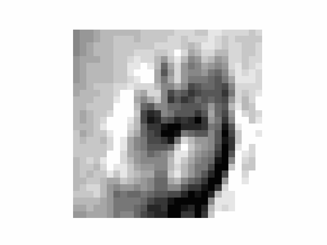

# Training and using Beta-VAE latent space to generate videos of hang movements

Here's an 100% articial video produced by the model traied with the repo:

The way to do it is simple: 
- Train a Beta-VAE with the Beta parameter set high. 
- Look a what happens with variations of the latent vector dimensions, take one that produces interesting variations (like here the height of the index finger)
- Make a Gif with all the variations.

I was inspired by this paper: https://openreview.net/pdf?id=Sy2fzU9gl