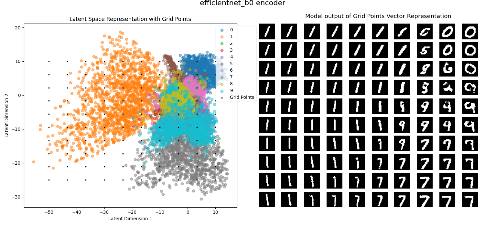
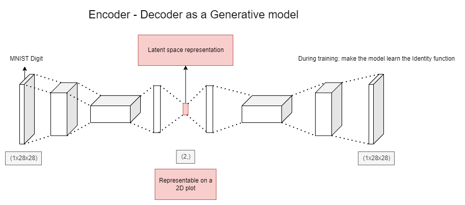
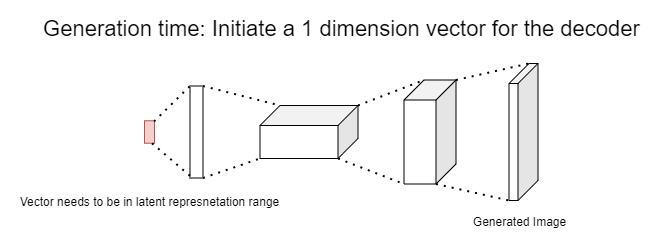

# Training and testing of a Varitional-AutoEncoder for Image Generation

With this repository, you can train and generate data (MNIST here) for all kinds of encoder. This can also be use to pretrain a model in a Unsupervised learning fashion.
This is what this can get you:

Feel free to use this repo for anything you like but since this is a project simply to build my intuition for VAE and GANs, I advise you code it yourself for the same purpose.
If you like the structure of the code, you can find my Computer Vision baseline here: 

Architecture used and the reason I can plot the points:

